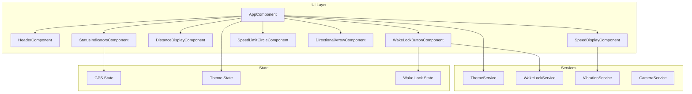
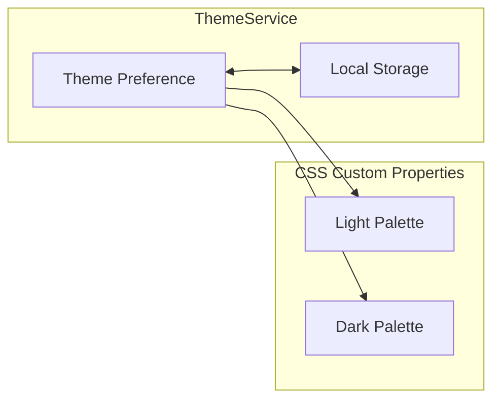

# Design Document: UX Redesign

## Overview

This design document outlines the UX/design improvements for the Cavefulmen speed camera warning app. The redesign focuses on improving visual hierarchy, adding dark mode support, enhancing status indicators, improving the directional arrow, implementing a speed warning system, refining the layout, and ensuring accessibility compliance.

The implementation will leverage Angular 18's standalone components architecture, CSS custom properties for theming, and progressive enhancement for features like vibration that may not be available on all platforms.

## Architecture

### High-Level Architecture



### Component Architecture

The app will be refactored from a single monolithic component into smaller, focused standalone components:

1. **AppComponent** - Main container, orchestrates child components
2. **HeaderComponent** - App branding and theme toggle
3. **StatusIndicatorsComponent** - GPS, connection, and wake lock status
4. **DistanceDisplayComponent** - Color-coded distance to camera
5. **SpeedDisplayComponent** - Color-coded current speed
6. **SpeedLimitCircleComponent** - Prominent speed limit display
7. **DirectionalArrowComponent** - Animated arrow pointing to camera
8. **WakeLockButtonComponent** - Screen wake lock toggle with status

### Theming Architecture



Theme switching will use CSS custom properties (CSS variables) defined at the `:root` level, allowing instant theme changes without component re-renders.

## Components and Interfaces

### ThemeService

```typescript
interface ThemeService {
  currentTheme$: Observable<'light' | 'dark'>;
  toggleTheme(): void;
  setTheme(theme: 'light' | 'dark'): void;
}
```

**Responsibilities:**
- Manage theme state (light/dark)
- Persist preference to localStorage
- Apply theme class to document body
- Load saved preference on initialization

### VibrationService

```typescript
interface VibrationService {
  isSupported(): boolean;
  vibrate(pattern: number | number[]): boolean;
  vibrateWarning(): void;
}
```

**Responsibilities:**
- Check Vibration API availability
- Provide warning vibration pattern
- Handle unsupported browsers gracefully

### StatusIndicatorsComponent

```typescript
interface StatusIndicatorsComponent {
  gpsAccuracy: number | null;
  isOnline: boolean;
  wakeLockActive: boolean;
}
```

**Inputs:**
- `gpsAccuracy`: GPS accuracy in meters (null if no fix)
- `isOnline`: Network connectivity status
- `wakeLockActive`: Whether wake lock is currently active

**Display Logic:**
- GPS: 3 bars (< 10m), 2 bars (10-30m), 1 bar (> 30m), 0 bars (null)
- Connection: Online/Offline icon
- Wake Lock: Active/Inactive indicator

### DistanceDisplayComponent

```typescript
interface DistanceDisplayComponent {
  distance: number;  // in kilometers
  isDarkMode: boolean;
}
```

**Color Logic:**
- Green: distance > 2km
- Yellow: 1km ≤ distance ≤ 2km
- Red: distance < 1km

### SpeedDisplayComponent

```typescript
interface SpeedDisplayComponent {
  speed: number | null;  // in km/h
  speedLimit: number | null;
  isWithinThreshold: boolean;
  isDarkMode: boolean;
}
```

**Color Logic (when within threshold):**
- Green: speed < (limit - 10)
- Yellow: (limit - 10) ≤ speed ≤ limit
- Red: speed > limit

**Vibration Trigger:**
- When speed > limit and within threshold, trigger vibration (with 5s cooldown)

### DirectionalArrowComponent

```typescript
interface DirectionalArrowComponent {
  angle: number;  // rotation in degrees
  isVisible: boolean;  // hidden when speed ≤ 10 km/h
  isPulsing: boolean;  // pulse when distance < 1km
  isDarkMode: boolean;
}
```

**Animation:**
- Smooth rotation transitions (CSS transition)
- Pulsing animation when approaching camera (CSS keyframes)

### SpeedLimitCircleComponent

```typescript
interface SpeedLimitCircleComponent {
  speedLimit: number;
  distance: number;
  isVisible: boolean;  // visible when within 4km threshold
}
```

**Visual Enhancement:**
- Scale up animation when distance < 1km
- Standard red circle with white background

### WakeLockButtonComponent

```typescript
interface WakeLockButtonComponent {
  isActive: boolean;
  onToggle: EventEmitter<void>;
}
```

**Visual States:**
- Inactive: Default button style with lock-open icon
- Active: Highlighted style with lock-closed icon
- Error: Brief error indication if activation fails

### HeaderComponent

```typescript
interface HeaderComponent {
  isDarkMode: boolean;
  onThemeToggle: EventEmitter<void>;
}
```

**Content:**
- App logo/name (subtle, non-distracting)
- Theme toggle button (sun/moon icon)

## Data Models

### Theme State

```typescript
type Theme = 'light' | 'dark';

interface ThemeState {
  current: Theme;
  isSystemPreference: boolean;
}
```

### GPS State

```typescript
interface GpsState {
  latitude: number | null;
  longitude: number | null;
  accuracy: number | null;
  speed: number | null;
  heading: number | null;
  timestamp: number | null;
  isLoading: boolean;
  error: GeolocationPositionError | null;
}
```

### App State

```typescript
interface AppState {
  gps: GpsState;
  theme: Theme;
  wakeLockActive: boolean;
  isOnline: boolean;
  lastVibrationTime: number | null;
}
```

### Color Thresholds

```typescript
const DISTANCE_THRESHOLDS = {
  GREEN: 2,    // > 2km
  YELLOW: 1,   // 1-2km
  RED: 0       // < 1km
} as const;

const SPEED_WARNING_MARGIN = 10;  // km/h below limit for yellow zone

const GPS_ACCURACY_THRESHOLDS = {
  STRONG: 10,   // < 10m
  MEDIUM: 30,   // 10-30m
  WEAK: Infinity // > 30m
} as const;

const VIBRATION_COOLDOWN = 5000;  // 5 seconds between vibrations
```

### CSS Theme Variables

```css
:root {
  /* Light theme (default) */
  --bg-primary: #ffffff;
  --bg-secondary: #f5f5f5;
  --text-primary: #1a1a1a;
  --text-secondary: #666666;
  
  /* Status colors */
  --color-safe: #22c55e;
  --color-warning: #eab308;
  --color-danger: #ef4444;
  
  /* Component specific */
  --arrow-color: #1a1a1a;
  --speed-limit-border: #ef4444;
  --speed-limit-bg: #ffffff;
}

:root.dark {
  --bg-primary: #1a1a1a;
  --bg-secondary: #2d2d2d;
  --text-primary: #f5f5f5;
  --text-secondary: #a3a3a3;
  
  /* Adjusted status colors for dark mode */
  --color-safe: #4ade80;
  --color-warning: #facc15;
  --color-danger: #f87171;
  
  --arrow-color: #f5f5f5;
}
```


## Correctness Properties

*A property is a characteristic or behavior that should hold true across all valid executions of a system—essentially, a formal statement about what the system should do. Properties serve as the bridge between human-readable specifications and machine-verifiable correctness guarantees.*

### Property 1: Theme Persistence Round-Trip

*For any* theme value ('light' or 'dark'), setting the theme and then reloading the app should result in the same theme being applied.

**Validates: Requirements 1.2, 1.3**

### Property 2: Theme Toggle State Flip

*For any* current theme state, calling toggleTheme() should result in the opposite theme being active.

**Validates: Requirements 1.4**

### Property 3: Distance to Color Mapping

*For any* distance value in kilometers, the computed distance color should be:
- Green when distance > 2
- Yellow when 1 ≤ distance ≤ 2
- Red when distance < 1

**Validates: Requirements 2.1, 2.2, 2.3**

### Property 4: GPS Accuracy to Signal Level Mapping

*For any* GPS accuracy value in meters (or null), the computed signal level should be:
- 3 (strong) when accuracy < 10
- 2 (medium) when 10 ≤ accuracy ≤ 30
- 1 (weak) when accuracy > 30
- 0 (no signal) when accuracy is null

**Validates: Requirements 4.1, 4.2, 4.3, 4.4, 4.5**

### Property 5: Speed Limit Circle Visibility

*For any* distance value, the speed limit circle should be visible if and only if distance ≤ 4 (the Distance_Threshold).

**Validates: Requirements 3.1**

### Property 6: Speed Limit Circle Prominence

*For any* distance value where the speed limit circle is visible, the circle should be in "prominent" mode if and only if distance < 1.

**Validates: Requirements 3.3**

### Property 7: GPS Loading State Transition

*For any* GPS state transition from loading (no position) to having a valid position, the app should transition from loading UI to main display.

**Validates: Requirements 5.1, 5.3**

### Property 8: Wake Lock UI State Consistency

*For any* wake lock service state (active/inactive), the wake lock button UI should reflect the same state.

**Validates: Requirements 6.1, 6.2**

### Property 9: Online Status Indicator Consistency

*For any* navigator.onLine state, the connection status indicator should display the matching online/offline state.

**Validates: Requirements 7.1, 7.2, 7.3**

### Property 10: Arrow Visibility Based on Speed

*For any* speed value in km/h, the directional arrow should be visible if and only if speed > 10.

**Validates: Requirements 8.3, 8.4**

### Property 11: Arrow Pulsing Based on Distance and Speed

*For any* combination of distance (km) and speed (km/h), the arrow should be pulsing if and only if (distance < 1 AND speed > 10).

**Validates: Requirements 9.1, 9.3**

### Property 12: Speed Display Color Based on Context

*For any* combination of current speed, speed limit, and distance to camera:
- When distance > 4 (outside threshold): default color
- When distance ≤ 4 and speed < (limit - 10): green
- When distance ≤ 4 and (limit - 10) ≤ speed ≤ limit: yellow
- When distance ≤ 4 and speed > limit: red

**Validates: Requirements 10.1, 10.2, 10.3, 10.4**

### Property 13: Vibration Trigger Conditions

*For any* combination of distance, speed, and speed limit, vibration should be triggered if and only if (distance ≤ 4 AND speed > limit AND Vibration API is available).

**Validates: Requirements 11.1, 11.4**

### Property 14: Vibration Cooldown Enforcement

*For any* sequence of vibration trigger conditions, vibrations should occur at most once per 5-second interval.

**Validates: Requirements 11.3**

### Property 15: Touch Target Minimum Size

*For any* interactive element in the app, its touch target dimensions should be at least 44x44 pixels.

**Validates: Requirements 15.1**

### Property 16: Aria Labels on Interactive Elements

*For any* interactive element (buttons, toggles, links), the element should have an aria-label attribute with a non-empty value.

**Validates: Requirements 17.1**

### Property 17: Aria Live Regions for Dynamic Content

*For any* dynamic content area (distance display, speed display, status indicators), the element should have an appropriate aria-live attribute.

**Validates: Requirements 17.2**

## Error Handling

### GPS Errors

| Error Code | Condition | Handling |
|------------|-----------|----------|
| PERMISSION_DENIED | User denied location access | Display permission request message with instructions |
| POSITION_UNAVAILABLE | GPS hardware unavailable | Display "GPS unavailable" message, continue with cached data if available |
| TIMEOUT | GPS fix took too long | Retry automatically, show "Searching for GPS..." message |

### Wake Lock Errors

| Condition | Handling |
|-----------|----------|
| API not supported | Fall back to video hack method (already implemented) |
| Request rejected | Show brief error toast, button remains in inactive state |
| Lock released unexpectedly | Re-acquire on visibility change (already implemented) |

### Vibration API Errors

| Condition | Handling |
|-----------|----------|
| API not supported (iOS) | Skip vibration silently, no error shown to user |
| Vibration fails | Log to console, continue without vibration |

### Network Errors

| Condition | Handling |
|-----------|----------|
| Offline | Show offline indicator, app continues with cached radar data |
| Online restored | Update indicator, no action needed (data is static JSON) |

### Theme Errors

| Condition | Handling |
|-----------|----------|
| localStorage unavailable | Use default theme (light), don't persist |
| Invalid stored value | Reset to default theme |

## Testing Strategy

### Unit Tests

Unit tests will cover specific examples and edge cases:

1. **ThemeService**
   - Toggle from light to dark
   - Toggle from dark to light
   - Load with no stored preference (default to light)
   - Load with invalid stored value

2. **Color Computation Functions**
   - Distance color at exact boundaries (1km, 2km)
   - Speed color at exact boundaries (limit-10, limit)
   - GPS signal at exact boundaries (10m, 30m)

3. **Visibility Logic**
   - Arrow visibility at exactly 10 km/h
   - Speed limit circle at exactly 4km
   - Pulsing at exactly 1km

4. **VibrationService**
   - Vibration pattern format
   - Cooldown timing
   - API availability check

### Property-Based Tests

Property-based tests will use **fast-check** library for TypeScript/JavaScript to verify universal properties across randomly generated inputs.

**Configuration:**
- Minimum 100 iterations per property test
- Each test tagged with: `Feature: ux-redesign, Property {N}: {description}`

**Properties to Test:**

1. **Theme round-trip** (Property 1)
   - Generate random theme values
   - Verify persistence and reload consistency

2. **Distance color mapping** (Property 3)
   - Generate random distances (0 to 100 km)
   - Verify color matches expected for all values

3. **GPS accuracy mapping** (Property 4)
   - Generate random accuracy values (0 to 1000m) and null
   - Verify signal level matches expected

4. **Speed limit visibility** (Property 5)
   - Generate random distances
   - Verify visibility matches threshold condition

5. **Arrow visibility** (Property 10)
   - Generate random speeds (0 to 200 km/h)
   - Verify visibility matches speed > 10 condition

6. **Arrow pulsing** (Property 11)
   - Generate random (distance, speed) pairs
   - Verify pulsing matches combined condition

7. **Speed color mapping** (Property 12)
   - Generate random (speed, limit, distance) tuples
   - Verify color matches expected for all combinations

8. **Vibration cooldown** (Property 14)
   - Generate random sequences of trigger events with timestamps
   - Verify vibrations respect 5-second minimum interval

### Integration Tests

Integration tests will verify component interactions:

1. **Theme propagation** - Theme change propagates to all components
2. **GPS state flow** - GPS updates flow through to all displays
3. **Wake lock lifecycle** - Button state matches service state through activate/deactivate cycle
4. **Vibration integration** - Speed exceeding limit triggers vibration service

### Accessibility Tests

1. **Axe-core** automated accessibility testing
2. **Manual screen reader testing** with VoiceOver/TalkBack
3. **Keyboard navigation testing**
4. **Color contrast verification** using browser dev tools
